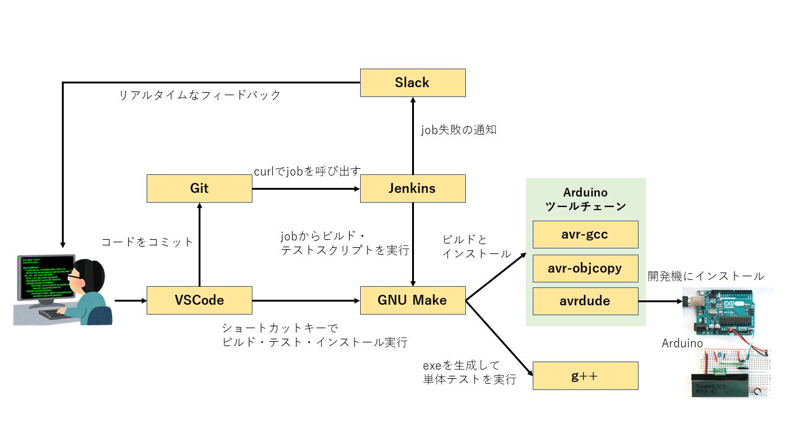

# Continuous Integration sample for embedded system

組み込みシステムにおける継続的インテグレーション(CI)構築のサンプルコードです。

継続的インテグレーションについては、Web上に詳しく説明した資料が多数ありますので、そちらを参照して下さい。
組み込みにおけるCIについては、私のブログにて説明しています。
https://iot-entrance.blog.jp/archives/8718967.html

サンプルではArduino UNO用のソフトウェアを構築しています。
ただし、実動作部分はほとんど何も実装していません。
実装しているのは主にmakefileとJenkinsスクリプトになります。

CIツールはOSSのJenkinsを使用しています。
ジョブはスクリプトファイル化しているので、Jenkins UI上ではこれらのファイルを呼び出す動作のみを行います。

# FLOW

# Features

このCIプラクティスは下記の要素を満たします。
ソースコードとテストコードはトップレベルで分離されています。

* コミットトリガによるテストスイートの起動
* 自動テストの実行
    * ビルド
    * ユニットテスト
    * カバレッジ測定
    * インストール(*1)
* slackによる開発者へのリアルタイムなフィードバック

(*1)...開発機上にソフトウェアを転送することです。今回の場合はArduinoにファームウェアを焼き込むことが相当します。

プロダクトコードのビルドは、makefileによりモジュールごとに独立して行われます。
これにより、変更されていないモジュールのビルドは省略され、ビルド時間が短縮されます。
一方で、単体テストについては、常にすべてのテストコードが実行されます。

また、モジュール単位でのビルド・テストも可能になっており、複雑なプロダクトコードの実装に適した形にしたつもりです。

# Requirement

* OS
    * [Arduino UNO](https://www.arduino.cc/) ... 開発マシン。プロダクトコードをこの上で動作させる。
    * Windows 10 ... ビルドマシン。プロダクトコードのコンパイル・転送と、単体テストを実行する。
* CI Platform
    * [Jenkins](https://www.jenkins.io/) ... CIツール。ビルド・単体テストなどの各フェーズをジョブとして表現する。
        * Slack notification plugin ... JenkinsからSlackにジョブの失敗を通知する。
    * [Git 2.27.0.windows.1](https://git-scm.com/) ... コミットフックの土台として利用。
        * Git Bash 4.4.23 ... Windows上でシェルスクリプトを動作させる土台として使用。
    * [Slack](https://slack.com/intl/ja-jp/) ... ジョブ失敗をここに通知
* Build tools
    * [GNU make 3.81](http://gnuwin32.sourceforge.net/packages/make.htm) ... ビルド・単体テスト・カバレッジ測定のコマンドを実行させる。
    * [Arduino IDE](https://www.arduino.cc/en/software)
        * avr-gcc ... AVRマイコン用のCクロスコンパイラ。Arduino IDEに付属。
        * avr-ar ... スタティックライブラリを生成するために利用。Arduino IDEに付属。
        * avr-objcopy ... ELFファイルからHEXファイルに変換する。Arduino IDEに付属。
        * avrdude ... HEXファイルをArduinoに転送する。Arduino IDEに付属。
    * [MinGW](http://mingw-w64.org/doku.php) ... Windows用のC言語/C++言語用コンパイラ。
        * g++ 8.1.0 ... Windows上でArduino用コードの単体テストを実行するために利用。カバレッジ測定用のプログラムを埋め込むこともできる。
        * gcov ... カバレッジ測定用ツール。
* Test tools
    * [CppUTest 3.8](http://cpputest.github.io/) ... C言語/C++言語用テストフレームワーク。テスト時、プロダクトコードにリンクして使用する。
    * [bc 1.06](http://gnuwin32.sourceforge.net/packages/bc.htm) ... カバレッジ測定結果を抽出する動作の一部に利用。

# Installation

準備中。
ブログにて記事を掲載する予定。

# Usage

準備中。
ブログにて記事を掲載する予定。

# Note

Windows上でCUIベースビルドを実現するためには色々と準備が必要なのでやや敷居が高いかもしれません。

# Author

不明点は下記までどうぞ。

* 作成者 : BARANCE
* Twitter : https://twitter.com/BARANCE_TW

# License

[MIT license](https://en.wikipedia.org/wiki/MIT_License).