# Continuous Integration sample for embedded system

組み込みシステムにおける継続的インテグレーション(CI)構築のサンプルコードです。

継続的インテグレーションについては、Web上に詳しく説明した資料が多数ありますので、そちらを参照して下さい。
組み込みにおけるCIについては、私のブログにて説明しています。
https://iot-entrance.blog.jp/archives/8718967.html

サンプルではArduino UNO用のソフトウェアを構築しています。
ただし、実動作部分はほとんど何も実装していません。
実装しているのは主にmakefileとJenkinsスクリプトになります。

CIツールはOSSのJenkinsを使用しています。
ジョブはスクリプトファイル化しているので、Jenkins UI上ではこれらのファイルを呼び出す動作のみを行います。

# Keywords

この資料で利用する用語を説明します。

* 開発マシン ... プログラムを実行するハードウェアを指します。今回の場合はArduino UNOが開発マシンとなります。実業務では、様々なプロダクト本体や、試作機等が開発マシンとなります。
* ビルドマシン ... プログラムのコーディング・ビルド・テストの実行と、開発マシンへのプログラムの転送を行うハードウェアを指します。今回の場合はWindowsを使用しています。実業務ではLinuxであることも多いです。また、コーディングとビルドマシンが分かれている場合もありますが、今回は取り扱いません(改造すれば対応は可能です)。
* プロダクトコード ... 開発マシン上で動作させるためにコーディングするソースコードをプロダクトコードと呼びます。プロダクトの開発目的を直接達成する成果物です。
* テストコード ... プロダクトコードが正常に動作するかをテストするためにコーヂングするコードをテストコードと呼びます。テストコードは開発マシンには転送されません。
* イメージ ... 開発マシンに直接転送可能なプログラムをイメージと呼びます。組み込みソフトウェア開発では、クロスコンパイラでソースコードをまずイメージに変換し、それを開発マシンに転送するという手順を取ります。

以下は一般的な用語ですが、知らない方のために簡単に解説します。

* テストフレームワーク ... 自動化可能なテストを簡単に記述するための様々な機能を持ったライブラリのことです。複数のテストの結果を集計する機能の他、戻り値が特定の値になっていない場合にテストを失敗させたり、特定の関数をテスト用の関数に入れ替えるというような機能(mock機能)などを持ちます。今回はC言語・C++言語の開発において一般的に使用されているCppUTestを利用します。
* カバレッジ ... テストの網羅率です。一般的には様々な定義がありますが、今回はプロダクトコード上の全ての行を1回以上実行した場合にカバレッジが100%となるルールを使用します。ちなみに、これは条件網羅でも分岐網羅でも条件分岐網羅でもありません。
* make ... makeはソフトウェアのビルドを効果的にビルドするために考案されたソフトウェアです。Makefileというファイルに成果物を構築するためのルールを記述し、makeプログラムがそれをパースすることで、実行ファイルやイメージを構築することができます。

# FLOW


# Features

このCIシステムでは下記が行えます。

* コミットトリガによるJenkinsジョブの起動。
* Jenkinsジョブによる下記の各処理の実行
    * ビルド
    * 単体テスト
    * カバレッジ測定
    * 開発マシンへのインストール
* ジョブ失敗時、slackにて開発者へリアルタイムにフィードバック。

## ディレクトリ構成

括弧`()`が付与されたファイル・ディレクトリは、ビルド・テスト・Jenkinsジョブ起動後などに生成されることを表します。
GitHub上のファイルには含まれていません。

```
+ embedded_ci
   + .vscode ... VSCodeの設定。
   |  + launch.json ... 実行用コマンドを記述。ビルド・転送を行う。
   |  + tasks.json ... ビルド単体用のコマンドと、テスト用コマンドを記述。
   + doc ... README.md用の画像ファイルを配置。
   + jenkins
   |  + script
   |  |  + build.sh ... ビルド単体を行うシェルスクリプト。
   |  |  + install.sh ... Arduinoへのイメージの転送を行うシェルスクリプト。
   |  |  + test.sh ... 単体テストとカバレッジ測定を実行するシェルスクリプト。
   |  |  + pipeline.groovy ... Jenkinsパイプライン用のスクリプト(*1)。
   |  + (work) ... Jenkinsでビルド・テストを行う際のワークディレクトリ(*2)
   |     + (build) ... buildジョブ用ワークスペース。
   |     + (install) ... installジョブ用ワークスペース。
   |     + (test) ... testジョブ用ワークスペース。
   + modules ... プロダクトコードが格納されたディレクトリ。モジュール別に分離されている。
   |  + Led ... LED制御モジュールのディレクトリ。
   |  |  + include ... プロダクトコード用のヘッダファイル。
   |  |  |  + led.h
   |  |  + (lib) ... ビルドするとLedモジュールの静的ライブラリが生成される。
   |  |  |  + (libLed.a)
   |  |  + (obj) ... ビルド用一時ファイルを格納するディレクトリ。
   |  |  |  + (led.o)
   |  |  + src .. プロダクトコードのソースファイル。
   |  |     + led.c
   |  + Makefile ... 下位ディレクトリのmakeを再帰的に呼び出してHEXファイルを生成する。
   |  + main.c ... プロダクトコードのmain()関数のあるソースファイル。
   + test ... 単体テスト・カバレッジ測定用のコードが格納されたディレクトリ。
   |  + Led ... 同名のディレクトリに対応するテストコードが格納されたディレクトリ。
   |  |  + (exe) ... テスト用の実行ファイルが格納されるディレクトリ。
   |  |  |  + (TestLed.exe)
   |  |  + include ... mock対象のヘッダが格納されたディレクトリ。
   |  |  |  + avr
   |  |  |     + io.h .. "avr/io.h"のモック用ヘッダ。
   |  |  + src ... テストコードが格納されたディレクトリ。
   |  |  |  + io.c ... "avr/io.h"のモックコード。
   |  |  |  + main.c ... テストプログラムのエントリポイントが含まれるファイル。
   |  |  |  + test_led.c ... Ledモジュールのテストコード。
   |  |  + Makefile ... このモジュールの単体テストとカバレッジ測定を行うMakefile。
   |  + definitions_project.mk ... プロジェクト共通設定が記載されたMakefile。
   |  + definitions_test_build_tools.mk ... テスト用のビルド設定が記載されたMakefile。
   |  + definitions_test_framework.mk ... テストフレームワーク(CppUTest)に関する設定。
   |  + Makefile ... 下位ディレクトリのmakeを再帰的に呼び出して全テストを実行する。
   + (output) ... Arduinoに転送するHEXファイルと、それの生成元のELFファイルが含まれる。
   |  + (arduino.elf)
   |  + (arduino.hex)
   + .gitignore ... 一時ファイルを追跡しないようにするGit用設定ファイル。
   + Makefile ... プロダクト全体のビルド・テスト・転送を実行するMakefile。
   + README.md ... 説明書ファイル(今見ているもの)。
```

- (*1)... build.sh, install.sh, test.shを呼び出すJenkinsジョブを起動するスクリプトです。
- (*2)... build.sh, install.sh, test.shを実行すると生成されます。このディレクトリは作業用の一時ファイルが格納されているディレクトリであり、.gitignoreに登録してありますのでGitHub上にはありません。

プロダクトコード・テストコードのビルドは、makefileにより各モジュールごとに独立して実行されます。
これにより、変更されていないモジュールのビルドは省略され、ビルド時間が短縮されます。
また、モジュール単位でのビルド・テストも可能になっています。

# Requirement

* Platform
    * [Arduino UNO](https://www.arduino.cc/) ... 開発マシン。イメージをこの上で動作させる。
    * Windows 10 ... ビルドマシン。プロダクトコードのコンパイル・転送と、単体テストを実行する。
* CI tools
    * [Jenkins](https://www.jenkins.io/) ... CIツール。ビルド・単体テストなどの各フェーズをジョブとして表現する。
        * Slack notification plugin ... JenkinsからSlackにジョブの失敗を通知する。
    * [Git 2.27.0.windows.1](https://git-scm.com/) ... コミットフックの土台として利用。
        * Git Bash 4.4.23 ... Windows上でシェルスクリプトを動作させる土台として使用。
    * [Slack](https://slack.com/intl/ja-jp/) ... ジョブ失敗をここに通知
* Build tools
    * [GNU make 3.81](http://gnuwin32.sourceforge.net/packages/make.htm) ... ビルド・単体テスト・カバレッジ測定のコマンドを実行させる。
    * [Arduino IDE](https://www.arduino.cc/en/software)
        * avr-gcc ... AVRマイコン用のCクロスコンパイラ。Arduino IDEに付属。
        * avr-ar ... スタティックライブラリを生成するために利用。Arduino IDEに付属。
        * avr-objcopy ... ELFファイルをイメージ(HEXファイル)に変換する。Arduino IDEに付属。
        * avrdude ... イメージ(HEXファイル)をArduinoに転送する。Arduino IDEに付属。
    * [MinGW](http://mingw-w64.org/doku.php) ... Windows用のC言語/C++言語用コンパイラ。
        * g++ 8.1.0 ... Windows上でArduino用コードの単体テストを実行するために利用。カバレッジ測定用のプログラムも埋め込む。
        * gcov ... カバレッジ測定用ツール。
* Test tools
    * [CppUTest 3.8](http://cpputest.github.io/) ... C言語/C++言語用テストフレームワーク。テスト時、テストコードにリンクして使用する。
    * [bc 1.06](http://gnuwin32.sourceforge.net/packages/bc.htm) ... カバレッジ測定結果を抽出する動作の一部に利用。

# Installation

Requirementの各プログラムを順にインストールしていけばよいです。

# Usage

ここでは、各ツールからビルド・テスト・開発マシンへの転送を行う方法と、自動化の構築方法を記載します。

## シェルからの実行

シェル操作にはGit Bashを利用します。コマンドプロンプト(cmd.exe)・PowerShell・CygwinなどとはディレクトリやCドライブの表現方法が異なるため注意してください。


コマンドはembedded_ciディレクトリ直下で実行します。
```
$ cd embedded_ci
```

- ビルド

makeコマンドを実行するのみです。ビルドを行うだけでは開発マシンにイメージは転送されません。また、テストコードのビルドも行われません。
```
$ make
```
- テスト

`make test`によりテストコードのビルド・テストの実行・カバレッジの測定が行われます。カバレッジ測定では、各モジュールのMakefile内に記載された`COVERAGE_TARGET_RATE`以下の網羅率になるとテストが失敗します。
```
$ make test
```
- イメージの転送

イメージをArduinoに転送します。Arduinoをビルドマシンに接続している必要があります。接続されていない場合はmakeが失敗します。また、このコマンド実行時にまだプロダクトコードのビルドが行われていない場合、先にビルドが実行されます。
```
$ make install
```
- 一時ファイルの削除

`make`や`make test`によって生成された下記のファイルを削除します。
1. 静的ライブラリ生成時の一時ファイル(`.obj`)
2. 各モジュールの静的ライブラリ(`.lib`)
3. カバレッジ測定用の一時ファイル(`.gcno`・`.gcna`・`.gcov`・`.gresult`)
4. Arduinoへの転送用のイメージ(`.hex`・`.elf`)
5. テスト用の実行ファイル(`.exe`)
```
$ make clean
```

## VSCodeからの実行

- ビルド : `Ctrl + Shift + B`
- 転送 : `F5`
- テスト :
    1. `Ctrl + Shift + P`
    2. リストから`Tasks: Run Test Task`を選択する。
- それ以外 :
    1. `Ctrl + Shift + P`
    2. リストから`Tasks: Run Task`を選択する。
    3. リストから実行したいタスク(cleanなど)を選択する。

## Jenkinsからの実行

1. JenkinsのシェルをGit Bashに変更します。
    1. Jenkinsにログインしてトップ画面を表示します。
    2. 「Jenkinsの管理」→「システムの設定」を表示します。
    3. ページの中ほどにある「シェル」→「シェル実行ファイル」のテキストボックスの値を、Git Bashの実行ファイルに変更します。GitをCドライブ直下にインストールした場合は、`C:\Program Files\Git\bin\bash.exe`となります。
    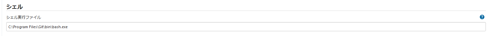
    4. ページ下部の「保存」を選択します。
2. Jenkins上にジョブを作成します。
    1. Jenkinsの管理画面に戻ります。
    2.  画面左上の「新規ジョブ作成」を選択します。
    3. 「Enter an item name」の下にあるテキストボックスにジョブの名前を登録します。今回の場合、ビルド・転送・テストをそれぞれ行うジョブ合計3個と、これらを一括して実行するパイプラインジョブを1個作成しますので、それに相当する名前にするとよいでしょう。
    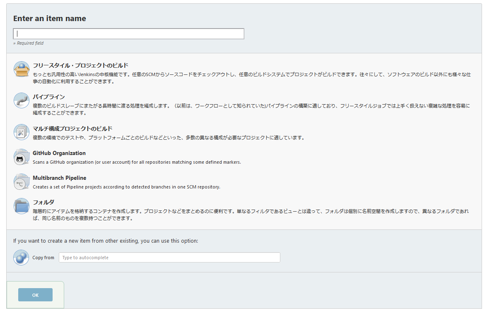
    4. ビルド・転送・テストを行うジョブの場合は、「フリースタイル・プロジェクトのビルド」を選択します。パイプラインジョブの場合は「パイプライン」を選択します。
    5. 画面下部の「OK」をクリックします。
    6. ビルド・転送・テスト・一括実行の各ジョブが全て作成されるまで、1～5を繰り返します。
3. ビルド・転送・テストジョブから`jenkins/script`ディレクトリ内のスクリプトファイルを呼び出すように設定します。
    1. Jenkinsのトップ画面に戻ります。
    2. 手順2で作成したビルド・転送・テストジョブのいずれかの名前をクリックします。
    3. そのジョブの詳細ページが表示されます。
    4. 画面左側の「設定」をクリックします。
    5. 「ビルド」→「ビルド手順の追加」→「シェルの実行」をクリックします。
    6. シェルスクリプトを記載するテキストボックスが現れますので、ここにjenkinsスクリプトファイルを実行するコマンドを記述します。コマンドは、Git Bashの文法に適合している必要があります。例えば、`C:\embedded_ci`にプロジェクトをcloneし、ビルドジョブの設定を行う場合は、`/C/embedded_ci/jenkins/script/build.sh`と記載します。
    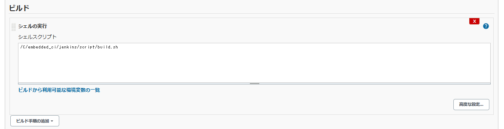
    7. 「保存」を選択します。
    8. ビルド・転送・テストの各ジョブが全て設定されるまで、1～7を繰り返します。
4. 一括実行ジョブからパイプラインスクリプトを呼び出すように設定します。
    1. Jenkinsのトップ画面に戻ります。
    2. 手順2で作成したパイプラインジョブの名前をクリックします。
    3. そのジョブの詳細ページが表示されます。
    4. 画面左側の「設定」をクリックします。
    5. 「パイプライン」→「定義」の下にあるリストボックスから、「Pipeline script from SCM」を選択します。
    6. パイプライン設定用の画面が表示されます。
    7. 「SCM」の下のリストボックスから「Git」を選択します。
    8. 「リポジトリURL」の下のテキストボックスに、このプロジェクトをcloneしたディレクトリへのパスを指定します。例えば、`C:\embedded_ci`にプロジェクトをcloneした場合は、`C\embedded_ci`になります。
    9. 「認証情報」は「なし」を選択します。
    10. 「ビルドするブランチ」は「*/master」を指定します。
    11. 「リポジトリ・ブラウザ」は「(自動)」を選択します。
    12. 「Script Path」の下のテキストボックスに、パイプラインスクリプトのパスを指定します。プロジェクトのルートディレクトリからの相対パスであることに注意してください。今回の場合は、`jenkins/script/pipeline.groovy`となります。
    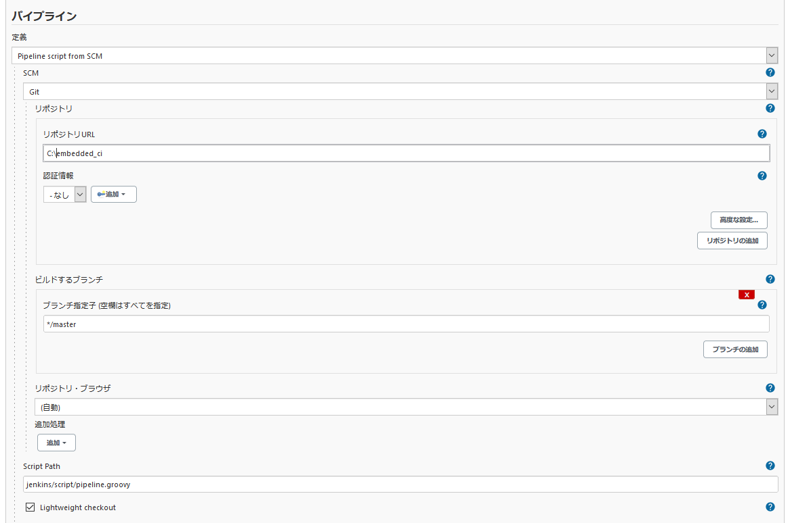
5. 実行したいジョブを選択して実行します。

## 自動化

### API tokenの発行

1. Jenkinsのトップ画面に戻ります。
2. 画面右上のユーザー名をクリックします。
3. ユーザーの画面が表示されたら、画面左側の「設定」をクリックします。
4. 「APIトークン」→「トークン新規追加」を選択します。
5. 適当な識別名を入力し「生成」をクリックします。
6. API tokenが生成されるので、この値をテキストファイルなどにバックアップしておきます。なお、この値は画面遷移すると二度と確認できませんので注意してください。
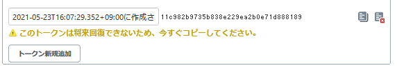

### Job access tokenの発行

1. Jenkinsのトップ画面に戻ります。
2. Job access tokenを発行したいジョブを一覧から選びます。今回の場合、一括実行ジョブのJob access tokenを発行することにします。
3. 一括実行ジョブのページが表示されたら、画面左側の「設定」をクリックします。
4. 「ビルドトリガ」の中にある「リモートからビルド」にチェックを入れます。
5. 「認証トークン」に任意の文字列を設定します。これがJob access tokenになります。
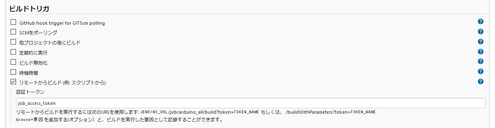
6. 画面下部の「保存」をクリックします。

### Git Hooksの設定

1. このプロジェクトをcloneしたフォルダをエクスプローラ等で表示します。
2. その直下にある「.git」ディレクトリを開きます。
    * 隠しファイル扱いになっているので、あらかじめエクスプローラの設定を変更し全てのファイルが表示されるようにしてください。
3. 「hocks」ディレクトリを開きます。
4. 「pre-commit」というファイルを作成し、テキストエディタなどで表示します。なお、POSIXコマンドを記述するファイルですから、文字コードはUTF-8、改行コードはLFに統一しておくことをおすすめします。
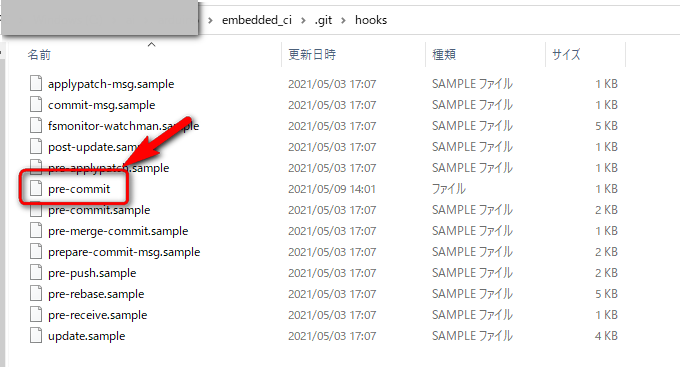
5. この中に下記のスクリプトコードを記載します。
    - \<Server address>\は、Jenkinsを起動しているサーバーのURLを指定します。Jenkinsサーバーとビルドマシンが同一ならば、`localhost`となります。
    - \<Port\>には、Jenkinsがリクエストを受け付けているポート番号を指定します。初期設定ならば`8080`となりますが、環境によっては変更される場合もあるので設定をよく確認してください。
    - \<User name\>にはビルドを行うJenkinsユーザー名を指定します。
    - \<Jenkins API Token\>には、\<User name\>に対応するユーザーのAPI tokenの値を指定します。
    - \<Job name\>には、コミット時に実行したいジョブの名前を指定します。今回の場合は、一括実行ジョブを指定するとよいでしょう。
    - \<Job Access Token\>には、\<Job name\>で指定したジョブのJob access tokenの値を指定します。(ユーザー毎のAPI tokenとは異なります！)
```
#!/bin/sh
curl --user "<User name>:<Jenkins API Token>" http://<Server address>:<Port>/job/<Job name>/build?token=<Job Access Token>
```

### Slack workspaceの開設

ビルド失敗投稿用にSlackのworkspaceを開設する必要があります。
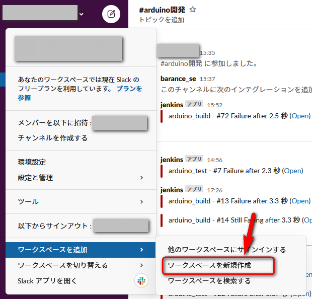

### Slack notification pluginのインストール

1. Jenkinsのトップ画面に戻ります。
2. 「Jenkinsの管理」→「プラグインの管理」を選択します。
3. 一覧から「Slack Notification」を発見し、左側にあるチェックボックスにチェックして画面下部の「Install without restart」を選択します。

### Slack notification pluginの設定

1. [SlackのJenkins CI設定ページ](https://my.slack.com/services/new/jenkins-ci)を開きます。ここでは、SlackにJenkins用の設定を施します。
2. 「チャンネルへの投稿」のリストボックスから、Jenkinsの通知を行うチャンネルを1つ選択し「Jenkins CIインテグレーションの追加」をクリックします。
3. 画面中程にある、下記の項目をコピーしてテキストファイルなどにバックアップします。忘れると面倒なので注意してください。また、この値が攻撃者に発見されるとSlackをハックされます。くれぐれもGitなどにコミットしたりしないように注意してください。
    - チームサブドメイン
    - インテグレーション用トークン認証情報ID
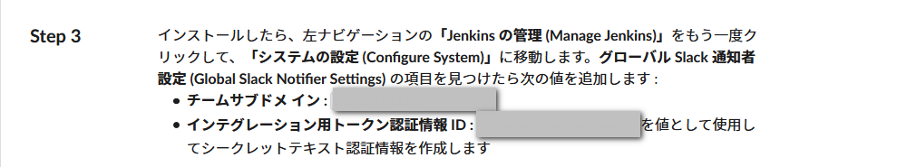
4. Jenkinsのトップ画面に戻ります。
5. 「Jenkinsの管理」→「システムの設定」を選択します。
6. ページ下部の「Slack」の項目を表示し、「workspace」に先程コピーした「チームサブドメイン」の値を入力します。
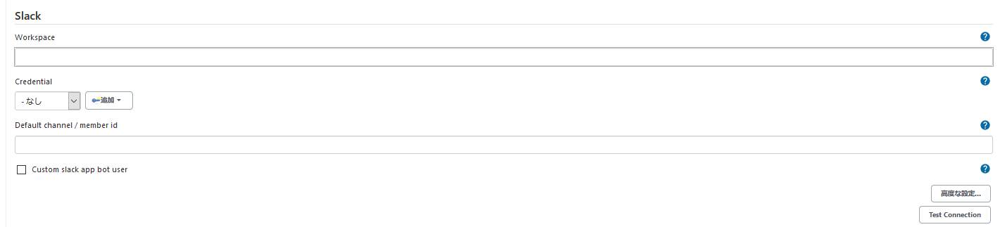
7. 「Credential」の右にある「追加」から「Jenkins」を選択します。
8. 「認証情報の追加」の画面が表示されますので、下記のように設定します。全て入力したら「追加」を選択します。
    - 「Domain」は「グローバルドメイン」を選択します。
    - 「種類」は「Secret text」を選択します。
    - 「スコープ」は「グローバル」を選択します。
    - 「Secret」は先程コピーした「インテグレーション用トークン認証情報ID」を入力します。
    - 「ID」には識別用の任意の名前を記入します。例えば、`Jenkins-token`などとしておけばよいでしょう。
    - 「説明」はこの設定の説明文を登録できます。省略しても構いません。
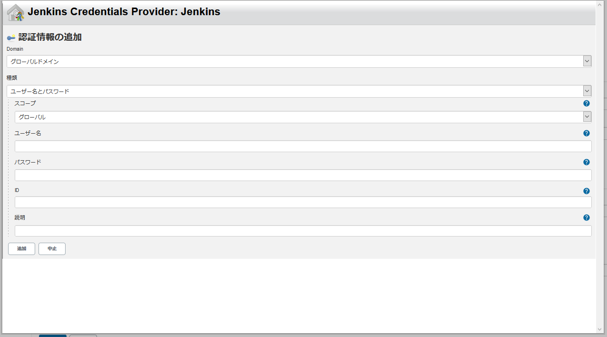
9. 「Credential」の下のリストボックスから、手順8で設定した「ID」と同じ名前を選択します。先程の例の通りにIDを設定していた場合は、`Jenkins-token`を選びます。
10. 画面下部の「保存」を選択します。
11. Jenkinsのトップ画面に戻ります。
12. ビルドジョブとテストジョブの設定画面をそれぞれ開き、「ビルド後の処理の追加」→「Slack notification」を選択します。
13. 「Notify Every Failure」にチェックを入れ、画面下部の「保存」を選択します。
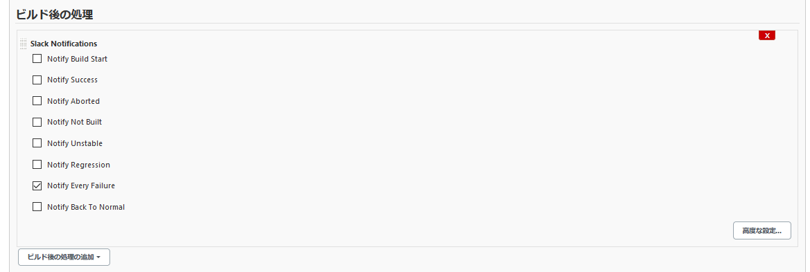

# Note

Windows上でCUIベースビルドを実現するためには色々と準備が必要なのでやや敷居が高いかもしれません。

# Author

不明点は下記までどうぞ。

* 作成者 : BARANCE
* Twitter : https://twitter.com/BARANCE_TW

# License

[MIT license](https://en.wikipedia.org/wiki/MIT_License).